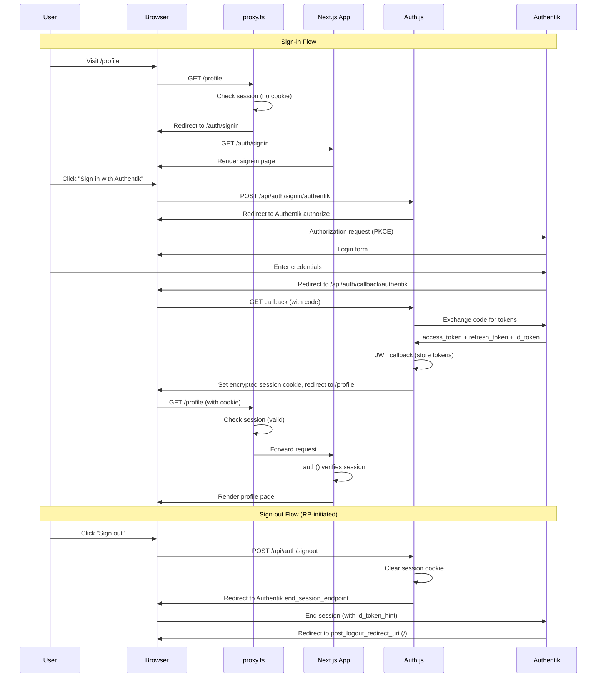

# feat: Add authentication with Auth.js v5 + Authentik OIDC

## Overview

Add authentication to the Specus web application using Auth.js v5 (NextAuth.js) with Authentik as the OIDC identity provider. This introduces a shared auth package in the monorepo, route protection via Next.js 16 `proxy.ts`, a sign-in page, a protected `/profile` page, and auth-aware navigation with full RP-initiated OIDC logout.

## Problem Frame

The Specus web application currently has zero authentication — all pages are publicly accessible with no user identity, session management, or access control.

**What this plan delivers:** Frontend authentication — user identity, session management, and UI-level access control. This enables user-specific experiences (profile, personalized views) and establishes the auth infrastructure that backend enforcement will build upon.

**What this plan does NOT deliver:** Data protection at the API layer. The backend API remains open and directly reachable (see Security Considerations — Open backend API). Frontend auth alone does not protect sensitive AML screening or procurement data from direct API access. Backend auth enforcement is a required follow-up to achieve data protection.

**Why start with frontend auth anyway:** It establishes the OIDC integration with Authentik, the session management infrastructure, and the token plumbing (access tokens stored server-only) that backend auth enforcement will consume. Building both simultaneously would increase risk and coupling.

Authentik is the team's chosen identity provider (self-hosted OIDC/OAuth2). Auth.js v5 provides the most mature Next.js integration for OIDC providers and supports the JWT session strategy needed for serverless/containerized deployments.

## Requirements Trace

- R1. Users can sign in via Authentik OIDC (redirect to Authentik, callback, session creation)
- R2. Users can sign out with full RP-initiated OIDC logout (session cleared + Authentik end_session_endpoint)
- R3. The `/profile` page is protected — unauthenticated users are redirected to sign in
- R4. All other routes remain public (home, AML, insight, profiling)
- R5. Auth configuration lives in a shared `@specus/auth` monorepo package, wired to the web app in this phase (admin app integration deferred)
- R6. The navbar shows auth state (sign-in button or user avatar/menu)
- R7. JWT strategy stores session in encrypted HttpOnly cookie (no database required)
- R8. Refresh token rotation keeps sessions alive without re-authentication
- R9. Environment variables follow Auth.js v5 conventions (`AUTH_*` prefix)

## Scope Boundaries

- **Not in scope**: Backend auth enforcement (backend is currently open, auth will be added later)
- **Not in scope**: Role-based access control or permissions — deferred to a future phase
- **Not in scope**: Admin app auth wiring — completely excluded from this plan; will be implemented when admin features are built
- **Not in scope**: Refactoring AML pages to server-side API calls (planned as follow-up when backend adds auth). **Migration cost note**: The server-only token decision means all existing client-side API calls (`apps/web/app/aml/search/page.tsx`, `apps/web/components/aml/sanction-sources-dialog.tsx`) must be migrated to Server Components or Server Actions to pass the access token. Estimate: 2-4 pages plus the API client configuration. This is the accepted tradeoff for preventing XSS exfiltration of bearer tokens.
- **Not in scope**: Custom Auth.js error pages (default Auth.js error route is acceptable for now)

## Context & Research

### Relevant Code and Patterns

- `apps/web/app/layout.tsx` — Root layout wraps children with `ThemeProvider`, `Navbar`, `Footer`. `SessionProvider` will need to be added here
- `apps/web/components/theme-provider.tsx` — Existing `'use client'` provider wrapper pattern to follow for session provider
- `apps/web/components/navbar.tsx` — Client component with no auth awareness; needs sign-in/sign-out UI
- `apps/web/components/navbar/desktop-nav.tsx` — No `'use client'` directive but imported by client component `navbar.tsx`, so runs as a client component
- `apps/web/components/navbar/mobile-nav.tsx` — Client component for mobile navigation
- `packages/api-client/src/client.ts` — API client config; currently only sets `baseUrl`
- `packages/api-client/src/generated/core/auth.gen.ts` — Auto-generated auth plumbing supports Bearer tokens but is unused
- `packages/ui/src/components/` — Shared UI components (button, card, dialog, sheet, badge, input, label, textarea). Missing: `avatar`, `dropdown-menu` (needed for user menu)
- `pnpm-workspace.yaml` — Dependency catalog pattern; `next-auth` should be added to catalog
- `turbo.json` — `globalEnv` must include `AUTH_*` variables

### External References

- [Auth.js v5 Next.js Reference](https://authjs.dev/reference/nextjs)
- [Auth.js Authentik Provider](https://authjs.dev/getting-started/providers/authentik)
- [Auth.js Refresh Token Rotation](https://authjs.dev/guides/refresh-token-rotation)
- [Auth.js TypeScript Guide](https://authjs.dev/getting-started/typescript)
- [Next.js 16 proxy.ts File Convention](https://nextjs.org/docs/app/api-reference/file-conventions/proxy)
- [Authentik OAuth2 Provider Setup](https://docs.goauthentik.io/add-secure-apps/providers/oauth2/)

## Key Technical Decisions

- **Auth.js v5 with built-in Authentik provider**: Auth.js ships a dedicated Authentik provider, eliminating the need for generic OIDC configuration. The `next-auth@5` package is currently in beta (`5.0.0-beta.30`). Pin to a specific beta version and track releases closely.

- **JWT strategy (no database adapter)**: Both apps use `output: 'standalone'` for containerized deployment. JWT strategy stores the encrypted session in an HttpOnly cookie, requiring no external session store. This is simpler and more portable.

- **Shared `packages/auth` package**: Following the monorepo pattern established by `@specus/api-client` and `@specus/ui`, auth configuration lives in a shared package. Both apps import from `@specus/auth` rather than duplicating config.

- **Next.js 16 `proxy.ts` with `middleware.ts` fallback**: Next.js 16 renames middleware to proxy and runs it on the Node.js runtime. The implementer should first verify that Auth.js v5's `auth()` export is compatible with the `proxy.ts` handler signature. If it is not (Auth.js v5 was primarily built against middleware.ts), fall back to `middleware.ts` which Next.js 16 still supports for backward compatibility.

- **`proxy.ts` as UX convenience, `auth()` as security gate**: The proxy redirects unauthenticated users to sign in (UX). Each protected page also calls `auth()` server-side as defense-in-depth (security). Neither is relied upon alone.

- **Full RP-initiated OIDC logout**: Sign-out clears the local session cookie AND redirects to Authentik's `end_session_endpoint` to terminate the IdP session. This prevents instant silent re-authentication via SSO.

- **Access token kept server-only**: The JWT callback stores `access_token`, `expires_at`, and `refresh_token` in the encrypted JWT cookie. The session callback does NOT expose `accessToken` to the client (to prevent XSS exfiltration). When backend auth is added, API calls should be made server-side via Server Components or Server Actions that call `auth()` to retrieve the token. The `session` callback only exposes `name`, `email`, `image`, and `error` (for `RefreshTokenError`) to client components.

- **New UI components via shadcn/Radix**: `avatar` and `dropdown-menu` components will be added to `@specus/ui` for the user menu. This follows the existing shadcn pattern in the project.

## Open Questions

### Resolved During Planning

- **Which routes are protected?** — Only `/profile` initially. All other routes (home, AML, insight, profiling) remain public. More routes will be protected as features mature.
- **Backend auth status?** — Backend is currently open. Token passing to the API client is deferred until the backend adds auth enforcement.
- **Sign-out behavior?** — Full RP-initiated logout (local cookie clear + Authentik end_session_endpoint redirect).
- **Shared auth package?** — Yes, `packages/auth` following existing monorepo patterns.
- **Separate Authentik applications per app?** — Yes, each app (web, admin) should have its own Authentik OAuth2 application with separate client credentials. This enables per-app access policies in Authentik. Each Authentik application should be bound to a specific user group to restrict who can authenticate.
- **Authentik OIDC issuer URL format?** — `https://<authentik-host>/application/o/<app-slug>` (no trailing slash). See Unit 2 for environment variable documentation.

### Deferred to Implementation

- **Cookie size with Authentik tokens**: The JWT cookie stores `access_token`, `refresh_token`, `id_token`, and `expires_at`. With three tokens (Authentik access tokens are JWTs, typically 800-2000 bytes), the encrypted cookie will likely approach or exceed the 4KB browser limit. **Enable Auth.js cookie chunking from the start** rather than waiting for it to break. Gate: do not proceed to production without measuring cookie size under realistic Authentik token sizes.
- **Refresh token rotation race condition**: Multiple tabs refreshing simultaneously can invalidate each other's refresh tokens. Mitigate by configuring Authentik's refresh token reuse grace period. Exact grace period to be determined during testing.
- **`next-auth@5` peer dependency with `next@16`**: Verify that `next-auth@5` accepts `next@16` in its peer dependency range. If not, use `pnpm.peerDependencyRules.allowedVersions` to override. Check this before starting Unit 1.
- **`proxy.ts` compatibility with Auth.js**: Verify that `export { auth as proxy } from '@specus/auth'` works with Next.js 16's proxy handler signature. If not, fall back to `middleware.ts`.

## High-Level Technical Design

> *This illustrates the intended approach and is directional guidance for review, not implementation specification. The implementing agent should treat it as context, not code to reproduce.*

## Implementation Units

- [ ] **Unit 0: Pre-implementation verification spike**

**Goal:** Verify two blocking compatibility questions before starting implementation: (1) `proxy.ts` compatibility with Auth.js v5, and (2) `next-auth@5` peer dependency with `next@16`.

**Requirements:** None (gates all other units)

**Dependencies:** None

**Files:** None (spike only, no committed code)

**Approach:**
- Create a minimal `proxy.ts` that imports `auth()` from `next-auth` and verify it works with Next.js 16.1.6. Record the result and update Unit 3 accordingly (proxy.ts or middleware.ts)
- Run `npm view next-auth@beta peerDependencies` to confirm `next@16` is in range. If not, document the `peerDependencyRules` override needed
- Measure a sample Authentik access token + id_token + refresh token size to validate cookie chunking assumption. **Decision gate**: if combined token size after encryption exceeds ~6KB (chunking produces 2+ cookies), re-evaluate whether JWT strategy is appropriate or if a server-side session store (Redis/database) would be simpler. Cookie chunking works but can cause issues with CDNs and reverse proxies that limit cookie header size

**Test expectation:** none — spike produces decisions, not shipped code

**Verification:**
- Proxy.ts vs middleware.ts decision is recorded
- Peer dependency compatibility is confirmed or override documented
- Token size measurement confirms JWT+chunking approach OR triggers a pivot to session-store strategy

---

- [ ] **Unit 1: Create `packages/auth` shared package**

**Goal:** Establish the shared auth configuration package with Auth.js v5 and Authentik OIDC provider, including JWT/session callbacks and refresh token rotation.

**Requirements:** R1, R5, R7, R8

**Dependencies:** Unit 0 (JWT vs. session-store decision must be made first)

**Files:**
- Create: `packages/auth/package.json`
- Create: `packages/auth/tsconfig.json`
- Create: `packages/auth/src/index.ts`
- Create: `packages/auth/src/auth.config.ts`
- Create: `packages/auth/src/types/next-auth.d.ts`
- Modify: `pnpm-workspace.yaml` (add `next-auth` to catalog)
- Test: Manual — verify package builds and exports resolve

**Approach:**
- `packages/auth/src/auth.config.ts` contains the `NextAuth()` call with Authentik provider, JWT strategy, and callbacks (jwt, session, signIn)
- `packages/auth/src/index.ts` re-exports `auth`, `handlers`, `signIn`, `signOut` from the config
- JWT callback: on initial sign-in, persist `access_token`, `id_token`, `expires_at`, `refresh_token` from `account`. On subsequent requests, check expiry and refresh via Authentik's token endpoint if expired
- Session callback: expose only `name`, `email`, `image`, and `error` (for `RefreshTokenError`) to the client. Do NOT expose `accessToken` to prevent XSS exfiltration — access tokens remain server-only, retrievable via `auth()` in Server Components/Actions
- Enable cookie chunking to handle the combined size of three tokens (access_token + refresh_token + id_token)
- TypeScript module augmentation in `src/types/next-auth.d.ts` extends `Session` and `JWT` types (placed inside `src/` to be within the tsconfig include path from `@specus/typescript-config/library.json`)
- Request `openid profile email offline_access` scopes (offline_access needed for refresh tokens)
- `package.json` exports `"."` pointing to `src/index.ts`, with `"next-auth": "catalog:"` as dependency (after adding `next-auth: "5.0.0-beta.30"` to `pnpm-workspace.yaml` catalog) and `next`, `react` as peer dependencies

**Patterns to follow:**
- `packages/api-client/package.json` for package structure and export map
- `packages/api-client/tsconfig.json` extending `@specus/typescript-config/library.json`

**Test scenarios:**
- Happy path: Package exports `auth`, `handlers`, `signIn`, `signOut` as named exports, and TypeScript resolves all types correctly
- Happy path: `pnpm install` succeeds and both apps can import `@specus/auth`
- Edge case: Module augmentation for `next-auth` types compiles without errors when imported from consuming apps

**Verification:**
- `pnpm install` succeeds with no resolution errors
- `import { auth, handlers, signIn, signOut } from '@specus/auth'` resolves in both apps' TypeScript context

---

- [ ] **Unit 2: Update environment variables and Turbo config**

**Goal:** Add all Auth.js v5 environment variables to `.env.example` and `turbo.json` so both apps receive them.

**Requirements:** R9

**Dependencies:** None (can run in parallel with Unit 1)

**Files:**
- Modify: `.env.example`
- Modify: `turbo.json`

**Approach:**
- Add to `.env.example` under the "SERVER / BUILD-TIME ONLY" section: `AUTH_SECRET`, `AUTH_TRUST_HOST`, `AUTH_AUTHENTIK_ID`, `AUTH_AUTHENTIK_SECRET`, `AUTH_AUTHENTIK_ISSUER`
- Add all five variables to `turbo.json` `globalEnv` array so Turbo passes them to all tasks and invalidates cache when they change
- `AUTH_SECRET` is generated via `npx auth secret` — document this in `.env.example` comments
- `AUTH_AUTHENTIK_ISSUER` format: `https://<authentik-host>/application/o/<app-slug>` (no trailing slash)

**Patterns to follow:**
- Existing `.env.example` section/comment structure

**Test scenarios:**
- Happy path: `turbo.json` is valid JSON and includes all five `AUTH_*` variables in `globalEnv`
- Happy path: `.env.example` documents all required variables with descriptions

**Verification:**
- `pnpm build` succeeds (Turbo recognizes the new env vars without breaking cache)
- `.env.example` has clear instructions for each variable

---

- [ ] **Unit 3: Wire auth into the web app (route handler + proxy + SessionProvider)**

**Goal:** Connect the shared `@specus/auth` package to the web app: API route handler for Auth.js, `proxy.ts` for route protection, and `SessionProvider` in the root layout.

**Requirements:** R1, R3, R4, R7

**Dependencies:** Unit 1, Unit 2

**Files:**
- Create: `apps/web/app/api/auth/[...nextauth]/route.ts`
- Create: `apps/web/proxy.ts` (or `apps/web/middleware.ts` if proxy.ts is incompatible with Auth.js)
- Create: `apps/web/components/session-provider.tsx`
- Modify: `apps/web/app/layout.tsx`
- Modify: `apps/web/package.json` (add `@specus/auth` dependency)
- Modify: `apps/web/tsconfig.json` (add `@specus/auth` path mapping)
- Test: Manual — verify sign-in redirect flow works end-to-end

**Approach:**
- `route.ts`: Re-export `GET` and `POST` from `@specus/auth` handlers. The `/api/auth/*` routes are excluded from proxy protection by design — Auth.js manages its own CSRF tokens for all POST actions
- `proxy.ts` (or `middleware.ts` fallback): Import `auth` from `@specus/auth` and wrap in a proxy function. For protected routes (initially only `/profile`), redirect unauthenticated users to `/auth/signin`. Use a matcher that excludes static assets, API routes, and auth pages: `/((?!api|auth|_next/static|_next/image|favicon.ico).*)`. Inside the handler, check if the matched path is a protected route (`/profile`) before redirecting — all other matched paths should pass through without auth checks. This keeps the broad matcher for future protected routes while explicitly allowing public pages. First verify `proxy.ts` compatibility; if Auth.js's `auth()` export is not compatible with the proxy handler signature, use `middleware.ts` instead
- `session-provider.tsx`: `'use client'` wrapper around `SessionProvider` from `next-auth/react`, following the existing `theme-provider.tsx` pattern
- `layout.tsx`: **Critical — `SessionProvider` must wrap both `Navbar` and `{children}`**, not just `{children}`. The `Navbar` contains the `UserMenu` which uses `useSession()`. Provider order: `ThemeProvider` > `SessionProvider` > (Suspense > Navbar) + main + Footer. Preserve the existing `<Suspense>` wrapper around `<Navbar />` — the navbar uses `useSearchParams()` which requires a Suspense boundary. Make the layout function `async` and call `auth()` server-side, then pass the session as a prop to `SessionProvider` (e.g., `<SessionProvider session={session}>`) to eliminate the client-side `/api/auth/session` fetch on initial page load and prevent a loading flash in the navbar
- `tsconfig.json`: Add path mapping `"@specus/auth": ["../../packages/auth/src/index.ts"]` following the existing `@specus/api-client` pattern

**Patterns to follow:**
- `apps/web/components/theme-provider.tsx` for the client provider wrapper pattern
- `apps/web/app/layout.tsx` for provider composition in the root layout

**Test scenarios:**
- Happy path: Visiting `/profile` while unauthenticated redirects to the sign-in page
- Happy path: Visiting `/` or `/aml` while unauthenticated renders normally (no redirect)
- Happy path: After signing in, `useSession()` returns the session with user name and email
- Edge case: Visiting `/api/auth/providers` returns Authentik as an available provider
- Error path: If `AUTH_SECRET` is missing, the app fails fast with a clear error (Auth.js built-in behavior)

**Verification:**
- `pnpm dev` starts without errors
- Navigating to `/profile` triggers the auth redirect flow
- Public pages load without any auth redirect

---

- [ ] **Unit 4: Create sign-in page**

**Goal:** Create a branded sign-in page at `/auth/signin` that redirects to Authentik OIDC.

**Requirements:** R1

**Dependencies:** Unit 3

**Files:**
- Create: `apps/web/app/auth/signin/page.tsx`
- Test: Manual — verify the sign-in page renders and the button triggers OIDC flow

**Approach:**
- Server component page. Use `auth()` to check if user is already authenticated — if so, redirect to `/profile`
- Display a centered card with the Specus logo and a "Sign in with Authentik" button
- The button triggers Auth.js sign-in by either using a form action with `signIn("authentik")` server action, or a link to `/api/auth/signin/authentik`
- Use `@specus/ui` components: `Card`, `Button`
- Accept a `callbackUrl` search param to redirect back to the original page after sign-in. **Security: validate `callbackUrl` as a relative path before passing to `signIn()`** — Auth.js v5 performs same-origin validation by default, but do not bypass it. Never derive `callbackUrl` from unvalidated user input with absolute URLs

**Patterns to follow:**
- `apps/web/app/not-found.tsx` for standalone page layout with centered content using `@specus/ui` components

**Interaction states:**
- **Idle**: Sign-in card with active button
- **Submitting**: Button disabled with loading spinner after click — prevents double-submit during OIDC redirect (the redirect may take 1-2 seconds)
- **Error**: If Auth.js returns `?error=<code>` query param (e.g., `OAuthSignin`, `OAuthCallback`), display an inline error banner above the button with a user-friendly message and a "Try again" action. Do not rely on Auth.js's unstyled default error page for callback errors that redirect back to the sign-in page

**Test scenarios:**
- Happy path: Unauthenticated user sees the sign-in card and can click the button to start OIDC flow
- Happy path: Authenticated user visiting `/auth/signin` is redirected to `/profile`
- Happy path: `callbackUrl` query param is preserved through the OIDC flow, and user is redirected back after sign-in
- Edge case: If Authentik is unreachable, Auth.js redirects to its built-in error page
- Edge case: Button is disabled and shows loading state while OIDC redirect is in progress
- Edge case: Auth.js error param displays inline error banner with retry option

**Verification:**
- `/auth/signin` renders a branded sign-in page
- Clicking "Sign in" initiates the Authentik OIDC authorization flow
- Successful callback sets the session cookie and redirects to the callback URL or `/profile`

---

- [ ] **Unit 5: Create protected `/profile` page**

**Goal:** Create the first protected page at `/profile` that displays the authenticated user's information from the Authentik profile.

**Requirements:** R3

**Dependencies:** Unit 3, Unit 4. Soft dependency on Unit 7 (sign-out button works with basic local sign-out; OIDC logout is layered on by Unit 7)

**Files:**
- Create: `apps/web/app/profile/page.tsx`
- Test: Manual — verify the page shows user info and is inaccessible without auth

**Approach:**
- Server component. Call `auth()` to get the session. If no session, redirect to `/auth/signin` (defense-in-depth — proxy.ts handles the first redirect, this is the security gate)
- Display user information: name, email, profile image (from Authentik). Use `@specus/ui` components: `Card`
- Include a sign-out button that triggers `signOut()` server action. Initially this performs local-only sign-out; Unit 7 upgrades it to full OIDC logout
- Keep the page simple — it serves as the proof-of-concept for protected routes

**Patterns to follow:**
- `apps/web/app/aml/page.tsx` for page structure

**Test scenarios:**
- Happy path: Authenticated user sees their name, email, and avatar on the profile page
- Happy path: Profile image falls back to name initials (first letter, or first two if name has space) on a neutral background; generic person icon if name is absent
- Error path: Unauthenticated user is redirected to `/auth/signin?callbackUrl=/profile`
- Edge case: Session with `RefreshTokenError` triggers re-authentication

**Verification:**
- `/profile` shows the current user's information when authenticated
- `/profile` redirects to sign-in when not authenticated
- User info matches what Authentik provides (name, email, image)

---

- [ ] **Unit 6: Add auth-aware navbar UI**

**Goal:** Update the navbar to show auth state — a "Sign in" button for unauthenticated users, and a user avatar with dropdown menu for authenticated users.

**Requirements:** R6

**Dependencies:** Unit 3. Soft dependency on Unit 7 (sign-out initially uses `signOut()` for local-only logout; Unit 7 upgrades to POST `/api/auth/federated-signout`)

**Files:**
- Create: `packages/ui/src/components/avatar.tsx`
- Create: `packages/ui/src/components/dropdown-menu.tsx`
- Create: `apps/web/components/navbar/user-menu.tsx`
- Modify: `apps/web/components/navbar.tsx`
- Modify: `apps/web/components/navbar/desktop-nav.tsx`
- Modify: `apps/web/components/navbar/mobile-nav.tsx`
- Test: Manual — verify sign-in button shows for unauthenticated, user menu for authenticated

Note: `@specus/ui` uses wildcard exports (`"./components/*": "./src/components/*.tsx"`), so adding new component files automatically makes them importable — no `package.json` modification needed.

**Approach:**
- Add `avatar` and `dropdown-menu` shadcn/Radix components to `@specus/ui` following the existing component pattern (using Radix primitives + CVA + Tailwind)
- Create `user-menu.tsx` as a `'use client'` component that uses `useSession()`:
  - **Loading state**: Render a fixed-size skeleton circle (32x32px, matching Avatar size) to prevent layout shift. Since the root layout passes a server-side `session` prop to `SessionProvider` (Unit 3), the loading state should be brief or absent on initial load — it mainly appears during client-side navigation
  - **Unauthenticated**: "Sign in" `Button` linking to `/auth/signin`
  - **Authenticated**: `Avatar` with user image/initials + `DropdownMenu` with "Profile" link and "Sign out" action
  - **RefreshTokenError**: When `session.error === "RefreshTokenError"`, call `signIn("authentik")` to force re-authentication
- Integrate `UserMenu` into the navbar (both desktop and mobile variants)
- Desktop: User menu appears to the right of navigation links
- Mobile (unauthenticated): "Sign in" button appears as a list item at the bottom of the Sheet nav, below the navigation links
- Mobile (authenticated): User avatar + name appears as a list item at the top of the Sheet nav (above navigation links), with "Profile" and "Sign out" as separate list items at the bottom. No nested dropdown — use flat list items within the Sheet for touch-friendly interaction

**Patterns to follow:**
- `packages/ui/src/components/button.tsx` for shadcn component structure
- `apps/web/components/navbar/mobile-nav.tsx` for `'use client'` navbar component pattern

**Test scenarios:**
- Happy path: Unauthenticated user sees "Sign in" button in both desktop and mobile nav
- Happy path: Authenticated user sees their avatar and name, clicking shows dropdown with "Profile" and "Sign out"
- Happy path: "Sign out" in dropdown triggers the sign-out flow
- Edge case: User with no profile image — display first letter of `session.user.name` (or first two letters if name contains a space), uppercase, on a neutral background. If name is absent, use a generic person icon from Lucide
- Edge case: Long user names — apply `max-w-[160px]` on desktop / `max-w-[120px]` on mobile with `overflow-hidden text-ellipsis` on the trigger; show full name in the dropdown body

**Verification:**
- Navbar reflects auth state correctly in both desktop and mobile layouts
- User can navigate to profile and trigger sign-out from the navbar

---

- [ ] **Unit 7: Configure RP-initiated OIDC logout**

**Goal:** Implement full sign-out that clears the local session and redirects to Authentik's `end_session_endpoint` to terminate the IdP session.

**Requirements:** R2

**Dependencies:** Unit 1, Unit 3

**Files:**
- Create: `apps/web/app/api/auth/federated-signout/route.ts`
- Test: Manual — verify sign-out redirects to Authentik and then back to the app

**Approach:**
- Auth.js v5's `events.signOut` callback is void (cannot return a redirect), so RP-initiated logout requires a **custom API route**:
  1. Store `id_token` in the JWT (needed as `id_token_hint` for the end_session_endpoint) — this is already done in Unit 1's JWT callback
  2. Create a custom `/api/auth/federated-signout` route handler that:
     a. Calls `auth()` to retrieve the `id_token` from the server-side JWT
     b. Clears the Auth.js session cookie by calling the internal sign-out mechanism
     c. Derives both `end_session_endpoint` (`${issuer}/end-session/`) and `revocation_endpoint` (`${issuer}/../../oauth/revoke/` or fetch from `.well-known/openid-configuration` once at module init and cache) from `AUTH_AUTHENTIK_ISSUER`. Use a consistent strategy for both endpoints — either both static derivation or both cached discovery
     d. Calls the revocation endpoint to explicitly revoke the `refresh_token` (RFC 7009)
     e. Redirects to `end_session_endpoint` with `id_token_hint` and `post_logout_redirect_uri` (hardcoded to the app's home page `/` — never derived from user input)
  3. Update the navbar/profile "Sign out" action to POST to `/api/auth/federated-signout` instead of calling `signOut()` directly
- **CSRF protection**: This custom route is outside Auth.js's built-in CSRF coverage. The route handler MUST enforce POST-only and validate a CSRF token (e.g., read the Auth.js CSRF cookie or implement a custom double-submit cookie check). Reject GET requests to prevent cross-origin forced logout via embedded `` or `<link>` tags
- The `post_logout_redirect_uri` must be registered in the Authentik application's allowed redirect URIs
- If Authentik's end_session_endpoint or revocation endpoint is unreachable, fall back to local-only sign-out and redirect to `/`

**Patterns to follow:**
- Auth.js v5 events API and JWT callback patterns from the framework documentation

**Test scenarios:**
- Happy path: Clicking "Sign out" clears the local cookie, redirects to Authentik's logout page, then redirects back to `/`
- Happy path: After sign-out, clicking "Sign in" requires re-entering credentials on Authentik (no silent SSO)
- Error path: If Authentik's end_session_endpoint is unreachable, local session is still cleared and user is redirected to `/`
- Edge case: `id_token` is missing from JWT (e.g., cookie was created before this change) — fall back to local-only sign-out
- Edge case: Authentik well-known response does not include `end_session_endpoint` — fall back to local-only sign-out and redirect to `/`

**Verification:**
- Sign-out fully terminates the Authentik session
- Subsequent sign-in requires re-authentication on Authentik
- User lands on `/` after the logout redirect chain completes

## Alternative Approaches Considered

- **Better Auth 1.5**: Most actively maintained auth library (daily commits, 27.5K stars). However, its stateless (no-DB) mode + custom OIDC provider + refresh token rotation — exactly our requirements — has open bugs (#7703, #7554). Designed database-first; stateless was bolted on in v1.4. Revisit in 3-6 months when these issues mature.
- **openid-client v6 + iron-session**: OpenID Certified OIDC library with zero open issues. Most reliable foundation but requires ~400-600 lines of hand-written auth code (session management, CSRF, route protection) vs Auth.js's ~50-80 lines. Best fallback if Auth.js becomes untenable.
- **Arctic v3**: Lightweight OAuth2 library with built-in Authentik support. However, Lucia ecosystem is winding down, and you must build all session/cookie/middleware infrastructure yourself.

**Why Auth.js v5 despite maintenance mode:** Our specific combination (JWT-only, no database, Authentik, refresh tokens) is Auth.js v5's strongest area and Better Auth's weakest. The `@specus/auth` shared package pattern isolates the dependency — migration to a successor is a contained change when a better option matures. Pin to a specific beta version and track releases.

## System-Wide Impact

- **Interaction graph:** `proxy.ts` intercepts every request before the route handler. Auth.js route handler at `/api/auth/[...nextauth]` handles all OAuth callbacks, CSRF, and session management. `SessionProvider` in the root layout provides client-side session context to all `'use client'` components.
- **Error propagation:** Auth.js handles most errors internally (redirects to `/api/auth/error`). Refresh token failures propagate via `session.error = "RefreshTokenError"` to client components. **Required client-side behavior**: When `useSession()` returns `session.error === "RefreshTokenError"`, the component must call `signIn("authentik")` to force re-authentication — do not silently ignore the error or show the stale session. The `UserMenu` component (Unit 6) should handle this centrally so all pages benefit. Authentik unavailability during sign-in results in Auth.js's built-in error page.
- **State lifecycle risks:** Cookie chunking is enabled from Unit 1 to handle Authentik's combined token size (access_token + refresh_token + id_token). Refresh token rotation with multiple browser tabs can cause race conditions — Authentik's reuse grace period mitigates this.
- **API surface parity:** The admin app (`@specus/admin`) is intentionally excluded from this plan. When admin features are built, it will consume the same `@specus/auth` package and follow the same patterns established here.
- **Unchanged invariants:** All existing pages (`/`, `/aml/*`, `/insight`, `/profiling`) remain public and functionally unchanged. The API client (`@specus/api-client`) is not modified — token passing will be added when the backend enforces auth.

## Security Considerations

- **Access tokens are server-only**: The `accessToken` is never exposed to client components via `useSession()`. This prevents XSS exfiltration of bearer credentials. When backend auth is enforced, API calls must be made server-side (Server Components, Server Actions, Route Handlers) using `auth()` to retrieve the token.
- **`callbackUrl` validation**: Auth.js v5 performs same-origin validation by default. The sign-in page must not bypass this. The `post_logout_redirect_uri` for OIDC logout is a hardcoded constant, never derived from user input.
- **Sign-out is intentionally one-click (no confirmation)**: Sign-out from the dropdown menu triggers immediately without a confirmation dialog. This is acceptable because (a) the action is in a dropdown requiring two deliberate clicks (avatar, then sign-out), reducing accidental triggers, and (b) sign-in via SSO is fast when the Authentik session is still active. If user research later shows accidental sign-outs are a problem, a confirmation step can be added.
- **Accessibility after auth redirects**: After OIDC callback (sign-in) and after sign-out redirect to `/`, focus should be managed by the receiving page's normal focus behavior. No special focus restoration is needed since these are full-page navigations (not SPA transitions). Radix UI's dropdown-menu and sheet components already handle keyboard navigation and focus trapping.
- **`AUTH_TRUST_HOST` production constraint**: Both apps use `output: 'standalone'`, meaning a reverse proxy is always present. Before deploying, **verify that the reverse proxy strips or validates `X-Forwarded-Host` before forwarding**. If it does, `AUTH_TRUST_HOST=true` is safe. If it does not, an attacker can inject `X-Forwarded-Host` to redirect OAuth callbacks to an attacker-controlled domain (callback hijacking). Document the proxy's header behavior as part of deployment verification.
- **CSRF on auth routes**: `/api/auth/*` routes are excluded from `proxy.ts` by the matcher pattern. Auth.js manages its own CSRF tokens (double-submit cookie) for all POST actions on these routes.
- **Open backend API (accepted risk)**: The backend API (`NEXT_PUBLIC_API_BASE_URL`) has no authentication and is reachable directly. Frontend auth does not protect the API layer. This is explicitly accepted for this phase — backend auth enforcement is planned as a follow-up. If the backend is network-isolated (not reachable from the public internet), document that as a compensating control.
- **Authentik application binding**: Each Authentik application must be bound to an authorized user group. Without this, any account in the Authentik directory (including test or service accounts) can authenticate to Specus. **Verification gate**: Before marking Unit 3 as complete, test that an Authentik user outside the bound group is denied access (receives an Authentik-side authorization error, not a Specus login).
- **`AUTH_SECRET` rotation**: Rotating `AUTH_SECRET` invalidates all active sessions immediately (every user must re-authenticate). Plan rotations during maintenance windows. Use separate `AUTH_SECRET` values per environment.

## Risks & Dependencies

| Risk | Mitigation |
|------|------------|
| Authentik tokens too large for JWT cookie (>4KB) | Enable cookie chunking proactively from Unit 1. Measure cookie size under realistic token sizes before production |
| Refresh token rotation race condition with multiple tabs | Configure Authentik's refresh token reuse grace period (30s recommended). Handle `RefreshTokenError` gracefully |
| `proxy.ts` incompatible with Auth.js v5 | Verify compatibility first. Fall back to `middleware.ts` which Next.js 16 still supports |
| `next-auth@5` peer dependency excludes `next@16` | Check `npm view next-auth@5 peerDependencies` before starting. Use `peerDependencyRules.allowedVersions` override if needed |
| Stolen refresh token remains valid after sign-out | Explicitly call Authentik's token revocation endpoint (RFC 7009) in the federated sign-out route before redirecting to `end_session_endpoint`. Do not rely on `end_session_endpoint` for token revocation |

## Sources & References

- Related code: `apps/web/app/layout.tsx`, `apps/web/components/theme-provider.tsx`, `packages/api-client/package.json`
- Related PR: #2 (Turborepo monorepo migration)
- External docs:
  - [Auth.js v5 Next.js Reference](https://authjs.dev/reference/nextjs)
  - [Auth.js Authentik Provider](https://authjs.dev/getting-started/providers/authentik)
  - [Auth.js Refresh Token Rotation](https://authjs.dev/guides/refresh-token-rotation)
  - [Next.js 16 proxy.ts](https://nextjs.org/docs/app/api-reference/file-conventions/proxy)
  - [Authentik OAuth2 Provider](https://docs.goauthentik.io/add-secure-apps/providers/oauth2/)
