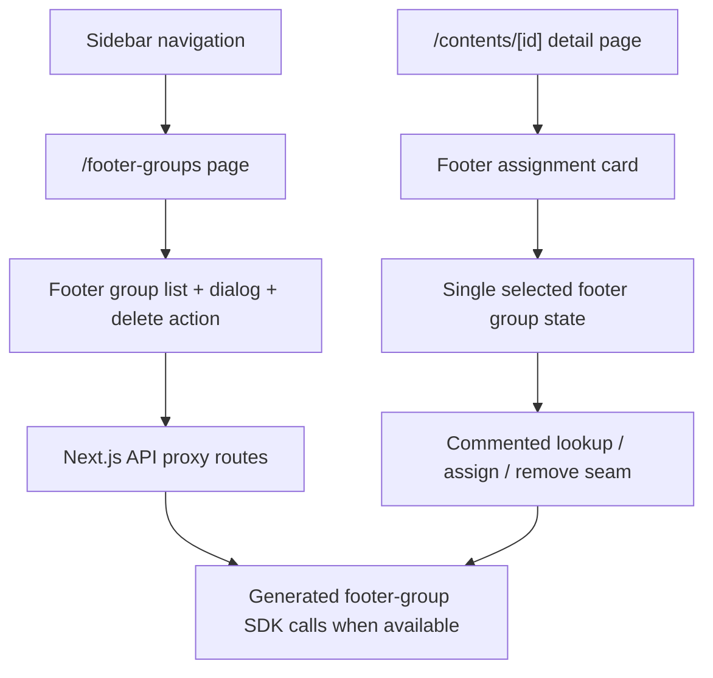

# feat: Add admin footer groups management

## Overview

Add a new footer-groups module to the admin app and extend the content detail page with a single-footer-group assignment surface. The new module should match the existing admin management pages in layout, controls, and interaction style. Because `packages/api-client` is the only allowed contract source and the checked-in generated client does not currently expose footer-group or content-footer membership operations, the plan intentionally prepares those data seams as commented placeholder logic instead of inventing an API contract.

## Problem Frame

The admin app already supports content, authors, categories, tags, page types, and uploads using a consistent dashboard pattern. Footer management is the missing CMS surface. The user wants two outcomes:

1. A dedicated admin module for managing footer groups that looks and behaves like the existing management modules.
2. A content detail enhancement that lets an editor place a content item into a footer group or remove it from the footer.

Two planning constraints shape the approach:

- `packages/api-client` is the source of truth for API capabilities.
- Missing footer-membership operations should not be guessed; the UI logic can be scaffolded and commented out until the generated client exposes the needed endpoints and types.

## Requirements Trace

- R1. Add a new admin footer-groups module using the same page style as existing admin modules.
- R2. Add footer-groups navigation entry in the dashboard sidebar.
- R3. Support the same management flow shape as the other simple admin modules: list, create/edit dialog if supported by the API, and delete action where supported.
- R4. Extend the content detail page with a footer assignment surface.
- R5. Enforce the confirmed product rule that one content item can belong to only one footer group.
- R6. Do not invent backend contracts that are not present in `packages/api-client`.
- R7. Leave the missing membership-check / assign / remove integration as clearly marked commented placeholder logic rather than silently assuming endpoint names or payloads.

## Scope Boundaries

- No backend or OpenAPI work is included in this plan.
- No changes to the public web footer rendering are included.
- No multi-footer assignment flow is allowed; membership is single-group only.
- No hidden inference based on unrelated content fields; footer status must eventually come from explicit footer-group APIs.

## Context & Research

### Relevant Code and Patterns

- `apps/admin/lib/navigation.ts` defines the sidebar groups and is the canonical place to add new admin modules.
- `apps/admin/app/(dashboard)/categories/page.tsx` is the closest CRUD-style pattern for a flat management page with dialog + delete confirmation.
- `apps/admin/app/(dashboard)/page-types/page.tsx` is the closest pattern for a lightweight flat list module with create dialog and delete action.
- `apps/admin/app/api/cms/categories/route.ts` and `apps/admin/app/api/cms/page-types/route.ts` show the server-side proxy pattern that forwards to backend CMS endpoints through `fetchWithAuth`.
- `apps/admin/app/(dashboard)/contents/[id]/page.tsx` is the current content detail screen and the correct place to add footer assignment UX.
- `apps/admin/components/contents/content-form.tsx` should remain focused on content fields that are part of the content create/update payload; footer membership should not be folded into this form until the contract explicitly supports it.

### API-Client Reality

- `packages/api-client/src/generated/index.ts`, `packages/api-client/src/generated/sdk.gen.ts`, and `packages/api-client/src/generated/types.gen.ts` currently expose no footer-group resource or content-footer membership operations.
- `CmsContent` currently has no footer membership field, so the content detail page cannot determine footer state from the existing content GET response.
- Because the user explicitly asked to proceed anyway, the plan prepares commented seams that can be activated once footer-group SDK exports are generated into `packages/api-client`.

### Institutional Learnings

- No relevant `docs/solutions/` directory exists in this repo at the time of planning.

### External References

- None needed. The repo already has strong local patterns for admin list/detail modules.

## Key Technical Decisions

- **Keep footer membership separate from `ContentForm`**: Footer assignment belongs on the content detail page as a dedicated section/card so the existing content update payload remains unchanged and we avoid mixing unsupported fields into `PUT /contents/{id}`.
- **Mirror the flat-management module style**: The footer-groups page should follow the same header, border/table, dropdown actions, confirmation dialog, and empty/loading patterns used by Categories and Page Types.
- **Treat footer membership as single-select UI**: Because one content can belong to only one footer group, the content detail page should use a single selected footer group state, not checkboxes or multi-select.
- **Do not invent SDK contracts**: Route handlers, SWR hooks, and footer assignment actions should be structured around the expected seam, but any unresolved request/response calls remain commented with TODO markers until `@specus/api-client` exports the real footer-group operations.
- **Prefer feature gating over fake behavior**: The content detail page should present the footer section in a way that makes the incomplete integration explicit to maintainers rather than pretending assignment is live when the data contract is missing.

## Open Questions

### Resolved During Planning

- Which API source should planning use: `packages/api-client`, not `openapi.yaml`.
- Can planning proceed without discovering a membership-check service first: yes, but the missing logic must stay scaffolded/commented.
- Can one content belong to multiple footer groups: no, membership is one-to-one.

### Deferred to Implementation

- The exact footer-group SDK function names, request payloads, and response types, because they are not yet exported from `packages/api-client`.
- Whether the footer-groups resource supports full edit/update, or only create/list/delete, because the checked-in client does not expose the resource yet.
- Whether content membership will be represented by a dedicated lookup endpoint, inclusion in a footer-group list response, or an enriched content detail response once the client is regenerated.

## High-Level Technical Design

> *This illustrates the intended approach and is directional guidance for review, not implementation specification. The implementing agent should treat it as context, not code to reproduce.*

## Public APIs / Interfaces / Types

- Add a new internal admin route surface under `apps/admin/app/(dashboard)/footer-groups/page.tsx`.
- Add new internal proxy route surface under `apps/admin/app/api/cms/footer-groups/...`.
- Add a local temporary footer-group view model only if needed to render the page before `@specus/api-client` exposes the real types; replace it immediately once generated exports exist.
- Do not change `ContentFormValues` or the existing content create/update payload shape in this work.

## Implementation Units

- [x] **Unit 1: Establish the footer-groups admin surface**

**Goal:** Add the navigation and page-level structure for footer-group management so the new module appears as a first-class admin section and matches the existing dashboard style.

**Requirements:** R1, R2

**Dependencies:** None

**Files:**
- Modify: `apps/admin/lib/navigation.ts`
- Create: `apps/admin/app/(dashboard)/footer-groups/page.tsx`
- Test: `apps/admin/app/(dashboard)/footer-groups/page.test.tsx`

**Approach:**
- Add a `Footer Groups` navigation item under the existing `Content` group using a content-adjacent icon.
- Build the page shell to match Categories / Page Types: header, supporting description, primary action button, bordered content container, loading row, empty state row, and dropdown action column.
- Keep the page layout stable even if data calls are still placeholders, so the module can be wired incrementally without redesigning the page.

**Patterns to follow:**
- `apps/admin/app/(dashboard)/categories/page.tsx`
- `apps/admin/app/(dashboard)/page-types/page.tsx`
- `apps/admin/lib/navigation.ts`

**Test scenarios:**
- Happy path: rendering the page shows the standard admin header, primary action button, and table container.
- Happy path: the sidebar includes the `Footer Groups` entry under the `Content` group and routes to `/footer-groups`.
- Edge case: when no footer groups are returned, the page shows an empty-state row/message rather than a broken table.
- Error path: when the page data load fails, the page shows the same style of recoverable error state used by adjacent admin modules.

**Verification:**
- The new module appears in the sidebar and opens a page whose structure is visually consistent with existing admin management screens.

- [x] **Unit 2: Add footer-group data seams and management interactions**

**Goal:** Prepare the local proxy/data layer and CRUD-style UI interactions for footer groups without guessing the unresolved backend contract.

**Requirements:** R1, R3, R6, R7

**Dependencies:** Unit 1

**Files:**
- Create: `apps/admin/app/api/cms/footer-groups/route.ts`
- Create: `apps/admin/app/api/cms/footer-groups/[id]/route.ts`
- Create: `apps/admin/components/footer-groups/footer-group-dialog.tsx`
- Create: `apps/admin/components/footer-groups/footer-groups-table.tsx`
- Create: `apps/admin/components/footer-groups/types.ts`
- Modify: `apps/admin/app/(dashboard)/footer-groups/page.tsx`
- Test: `apps/admin/app/api/cms/footer-groups/route.test.ts`
- Test: `apps/admin/components/footer-groups/footer-group-dialog.test.tsx`

**Approach:**
- Structure the new route handlers exactly like Categories / Page Types proxy routes, but only wire real `fetchWithAuth` calls once the generated footer-group SDK contract exists.
- If the footer-group resource shape is still absent at implementation time, keep the actual request invocation commented with a tight TODO that names the intended generated client replacement point.
- Keep the page implementation ready for the common flat-resource flow: list existing groups, open create/edit dialog, and confirm deletion.
- Use a small local module type only as a temporary rendering contract if the SDK still has no footer-group types; isolate that type so it is easy to delete once generated exports exist.
- Prefer `mutate()`/SWR refresh after successful create/edit/delete to preserve consistency with the rest of the admin module.

**Execution note:** Do not hardcode endpoint paths or payload shapes that are not already confirmed by `packages/api-client`; unresolved network lines should remain commented rather than speculative.

**Patterns to follow:**
- `apps/admin/app/api/cms/categories/route.ts`
- `apps/admin/app/api/cms/page-types/route.ts`
- `apps/admin/components/page-types/page-type-dialog.tsx`
- `apps/admin/components/authors/author-dialog.tsx`

**Test scenarios:**
- Happy path: when footer-group list data is available, the table renders rows and row actions correctly.
- Happy path: opening the create/edit dialog preloads the right values for create vs edit mode.
- Edge case: if the data seam is still unresolved, the page shows a controlled placeholder/disabled interaction instead of firing a broken request.
- Error path: create/edit/delete failures surface toast or inline errors consistent with other admin modules.
- Integration: the proxy routes forward backend errors through Next.js route handlers without losing status codes or message payloads.

**Verification:**
- The footer-groups page can host the full interaction flow shape without inventing unsupported backend calls, and the intended integration seam is obvious to the next implementer.

- [x] **Unit 3: Extend content detail with single footer-group assignment UX**

**Goal:** Add a dedicated footer section to the content detail page that supports the confirmed one-content-to-one-footer-group rule and prepares assign/remove behavior for later activation.

**Requirements:** R4, R5, R6, R7

**Dependencies:** Unit 2

**Files:**
- Create: `apps/admin/components/contents/footer-group-card.tsx`
- Create: `apps/admin/app/api/cms/contents/[id]/footer-group/route.ts`
- Modify: `apps/admin/app/(dashboard)/contents/[id]/page.tsx`
- Test: `apps/admin/components/contents/footer-group-card.test.tsx`
- Test: `apps/admin/app/api/cms/contents/[id]/footer-group/route.test.ts`

**Approach:**
- Add a new card/section on the content detail page outside the existing `ContentForm` block so footer membership is managed independently from core content updates.
- Model the UI around a single selected footer group: one current assignment, one candidate selection, one assign action, and one remove action.
- Load footer-group options from the same footer-groups data seam used by the new module so the admin uses one consistent source of list data.
- Prepare a membership status read path and assign/remove mutations behind commented-out integration code if the SDK still lacks these operations.
- Render the section in a maintainable “not yet connected” state when membership lookup cannot be completed yet, rather than guessing based on unrelated content fields.

**Execution note:** Keep the unresolved membership lookup / assign / remove request logic commented with explicit TODOs tied to the eventual `@specus/api-client` exports.

**Patterns to follow:**
- `apps/admin/app/(dashboard)/contents/[id]/page.tsx`
- `apps/admin/components/contents/delete-content-dialog.tsx`
- `apps/admin/components/contents/data-table-row-actions.tsx`

**Test scenarios:**
- Happy path: the content detail page renders a footer management section alongside the existing content editing UI.
- Happy path: when a single current footer group is known, the section displays that assignment and enables removal.
- Happy path: when no footer group is assigned, the section allows selecting exactly one group from the available options.
- Edge case: the currently assigned footer group is no longer in the selectable list; the UI preserves the known current value and avoids silently clearing it.
- Edge case: footer-group options are still loading while content is already loaded; the page keeps the main edit form usable and isolates the loading state to the footer card.
- Error path: lookup / assign / remove failures show localized feedback and do not break the main content editing flow.
- Integration: assigning a footer group updates only the footer section state and does not alter the content form payload or submit path.

**Verification:**
- Editors can see a dedicated footer assignment surface on the content detail page, and the code clearly separates live content editing from the still-pending footer membership integration.

## System-Wide Impact

- **Interaction graph:** `navigation.ts` gains a new content-management entry; the new footer-groups page and new content footer card both depend on the same footer-group data seam.
- **Error propagation:** footer-related proxy routes should preserve backend status codes/messages exactly like existing CMS proxy routes so UI toasts and loading states behave consistently.
- **State lifecycle risks:** content edit state and footer membership state must remain independent so a footer assignment failure does not discard unsaved content edits.
- **API surface parity:** once `packages/api-client` exports footer-group operations, both the footer-groups module and the content detail footer card should adopt the same generated functions and shared view-model mapping.
- **Integration coverage:** the most important cross-layer checks are route-handler passthrough, one-to-one footer assignment behavior, and preserving content edit flow when footer actions fail.
- **Unchanged invariants:** existing content create/update/delete behavior, taxonomy pages, and content form payload shape remain unchanged by this plan.

## Risks & Dependencies

| Risk | Mitigation |
|------|------------|
| The generated client still does not expose footer-group resources during implementation | Keep placeholder seams isolated and commented so no speculative backend contract leaks into shipping code |
| Footer-group resource supports fewer operations than the UI initially expects | Mirror Categories/Page Types structure, but gate create/edit/delete controls behind the actual generated operations rather than assuming full CRUD |
| Footer assignment UX accidentally couples to the main content form submission | Implement footer controls in a separate card/component with separate local state and handlers |
| Placeholder logic becomes permanent and confusing | Use tight TODO comments that point directly to the missing `@specus/api-client` replacement seam and avoid spreading placeholders across unrelated files |

## Documentation / Operational Notes

- If footer-group SDK exports are generated later, update this plan’s temporary local types/comments first so the integration seam stays obvious.
- If the eventual backend contract supports only partial footer-group management, narrow the page actions to the supported subset instead of emulating unsupported behavior in the frontend.

## Sources & References

- Related code: `apps/admin/app/(dashboard)/categories/page.tsx`
- Related code: `apps/admin/app/(dashboard)/page-types/page.tsx`
- Related code: `apps/admin/app/(dashboard)/contents/[id]/page.tsx`
- Related code: `apps/admin/app/api/cms/categories/route.ts`
- Related code: `packages/api-client/src/generated/index.ts`
- Related code: `packages/api-client/src/generated/sdk.gen.ts`
- Related code: `packages/api-client/src/generated/types.gen.ts`
