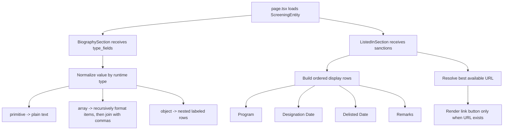

# feat: Integrate AML entity detail page with new API UI

## Overview

Update the AML entity detail page at `apps/web/app/(main)/aml/search/[id]/page.tsx` so it renders the new API response shape instead of the current placeholder UI. The page should keep the existing layout and visual language, but make two data-heavy sections reliable: biodata must render arbitrary `type_fields` values safely, and sanction history must render a fixed ordered set of fields plus link actions when URL-like metadata is available.

## Problem Frame

The detail page already fetches `ScreeningEntity` from `@specus/api-client`, but the UI is only partially integrated. `BiographySection` currently stringifies every `type_fields` value directly, which breaks for arrays and nested objects, and `ListedInSection` still renders placeholder rows unrelated to the new sanction payload. The requested work is a frontend integration pass: consume the updated API contract already exposed in `packages/api-client`, preserve the current page shell, and replace placeholder detail rendering with data-aware output that handles heterogeneous API values without crashing or leaking raw `[object Object]` strings into the UI.

## Requirements Trace

- R1. Keep `apps/web/app/(main)/aml/search/[id]/page.tsx` as the entity detail route and continue loading the selected `ScreeningEntity` by id.
- R2. Render biodata from `ScreeningEntity.type_fields`.
- R3. When a biodata value is a list, render its items as a comma-separated string.
- R4. When a biodata value is an object, render nested key/value pairs recursively instead of stringifying the whole object.
- R5. Render sanction history from `ScreeningEntity.sanctions`, not from static placeholders or only `sanctions_list` summaries.
- R6. In sanction history, render fields in this fixed order only: Program, Designation Date, Delisted Date, Remarks.
- R7. Omit sanction-history fields whose values are `null`, `undefined`, or empty.
- R8. When a sanction entry exposes `source_link` or a similar URL field, render a link button for that entry.
- R9. Preserve the current visual style and avoid a page-level crash when the API returns sparse or mixed-shape values.
- R10. Add regression coverage for recursive biodata formatting and sanction-history ordering/link behavior.

## Scope Boundaries

- No backend or OpenAPI changes are included; this plan only consumes the already-generated client in `packages/api-client`.
- No redesign of the page shell, search input, or header layout is included.
- No new filtering, sorting, or search behavior is included for sanctions.
- No attempt to infer new product fields beyond the current generated types is included; unknown keys stay display-only.

## Context & Research

### Relevant Code and Patterns

- `apps/web/app/(main)/aml/search/[id]/page.tsx` is the route boundary and already fetches `getScreeningEntity(...)`.
- `apps/web/components/aml/biography-section.tsx` is the current biodata renderer and already owns label formatting plus the entity-type image.
- `apps/web/components/aml/listed-in-section.tsx` is the current sanction-history surface, but it still renders placeholder content and only receives `SanctionsListSummary[]`.
- `packages/api-client/src/generated/types.gen.ts` defines the current AML data contract:
  - `ScreeningEntity.type_fields?: { [key: string]: unknown }`
  - `ScreeningEntity.sanctions: EntitySanction[]`
  - `EntitySanction.program?: string`
  - `EntitySanction.designation_date?: string`
  - `EntitySanction.delisting_date?: string`
  - `EntitySanction.remarks?: string`
  - `EntitySanction.list_url?: string`
  - `EntitySanction.properties?: { [key: string]: unknown }`
- `apps/web/components/aml/sanction-sources-dialog.tsx` shows the current AML link treatment for source URLs and is the closest local pattern for external-link styling in this feature area.
- `apps/web/components/footer/footer.test.tsx` and `apps/web/components/footer/footer-links.test.tsx` show the current `apps/web` testing setup pattern with Vitest and Testing Library.

### Institutional Learnings

- No `docs/solutions/` entries were present in this repo during planning, so there are no stored institutional learnings to inherit for AML detail rendering.

### External References

- None. The repo already has the generated API contract and a bounded existing UI surface, so external research would add little value compared with following local patterns.

## Key Technical Decisions

- **Keep formatting logic close to AML UI components**: The shape-specific rendering rules should live in the AML component layer, potentially extracted into a small local formatter/helper module if the recursion becomes hard to read inline.
- **Normalize values before rendering**: Biodata rendering should convert arrays, nested objects, primitive scalars, and empty values into a display model before JSX mapping, so the component tree stays simple and predictable.
- **Treat sanction history as event entries, not list summaries**: The detail page should pass `entity.sanctions` into the sanction-history section, because the new API exposes event-level fields directly on `EntitySanction`.
- **Use fixed ordered sanction fields instead of dynamic key iteration**: The user explicitly wants a stable order and selective omission, so the section should build rows from a curated field list rather than iterating over `properties`.
- **Support link-button rendering through URL normalization**: Because the generated client exposes `list_url` but the request mentions `source_link` or similar fields, the implementation should normalize “best available URL” from known top-level and property-level candidates before deciding whether to render the button.
- **Keep sparse data silent**: Empty or null values should be filtered out per row rather than rendered as blank labels, placeholder copy, or “N/A” noise.

## Open Questions

### Resolved During Planning

- **Which API fields are authoritative for biodata?** `ScreeningEntity.type_fields`.
- **Which collection should drive sanction history?** `ScreeningEntity.sanctions`.
- **Should sanction history remain dynamically keyed like biodata?** No; it should use the fixed field order requested by the user.
- **How should arrays in biodata render?** As comma-separated values after recursively formatting each element.

### Deferred to Implementation

- **Exact URL candidate precedence for sanction links**: The generated type exposes `list_url`, while the request references `source_link` or “smt”. The implementation should confirm the live payload shape and finalize the priority order among `list_url` and any URL-like values inside `properties`.
- **Display formatting for date strings**: The generated contract exposes raw strings. The implementation can keep them as-is unless the live UI already expects a shared date-format helper.
- **How deep nested biodata objects should indent visually**: The plan assumes recursive key/value rendering within the existing typography stack, but the final spacing treatment can be tuned once the JSX is in place.

## High-Level Technical Design

> *This illustrates the intended approach and is directional guidance for review, not implementation specification. The implementing agent should treat it as context, not code to reproduce.*

## Implementation Units

- [x] **Unit 1: Rewire the AML detail route to pass the new entity detail data to dedicated sections**

**Goal:** Make the route boundary pass the right API data shapes into the page sections so the UI can consume the updated contract without relying on summary-only data.

**Requirements:** R1, R2, R5, R9

**Dependencies:** None

**Files:**
- Modify: `apps/web/app/(main)/aml/search/[id]/page.tsx`
- Modify: `apps/web/components/aml/biography-section.tsx`
- Modify: `apps/web/components/aml/listed-in-section.tsx`
- Create: `apps/web/app/(main)/aml/search/[id]/page.test.tsx`

**Approach:**
- Keep the existing route-level fetch, loading, and error handling in place.
- Change the sanction-history section input from derived `sanctions_list` summaries to `entity.sanctions`.
- Preserve the current header and page shell, but update section props so each section receives the shape it actually needs.
- If route-level tests feel too heavy for this page, keep the route test narrow and let most behavioral assertions live at the component level.

**Patterns to follow:**
- `apps/web/app/(main)/aml/search/[id]/page.tsx` for the existing fetch lifecycle.
- `apps/web/components/aml/search-result-header.tsx` for current page composition boundaries.

**Test scenarios:**
- Happy path: a fetched entity with `type_fields` and `sanctions` renders the header plus both detail sections.
- Edge case: an entity with empty `type_fields` and no sanctions still renders the page without placeholder crashes.
- Error path: failed detail fetch still shows the existing route-level error state.

**Verification:**
- The detail route continues to load by id and the page sections now receive event-level sanction data instead of summary-only sources.

- [x] **Unit 2: Add recursive biodata formatting for heterogeneous `type_fields` values**

**Goal:** Replace naive stringification in `BiographySection` with a formatter that renders primitives, arrays, and nested objects safely.

**Requirements:** R2, R3, R4, R9, R10

**Dependencies:** Unit 1

**Files:**
- Modify: `apps/web/components/aml/biography-section.tsx`
- Create: `apps/web/components/aml/entity-detail-formatters.ts`
- Test: `apps/web/components/aml/biography-section.test.tsx`
- Test: `apps/web/components/aml/entity-detail-formatters.test.ts`

**Approach:**
- Extract label normalization and runtime value formatting into a small helper so recursive logic is testable without rendering the entire page.
- Filter out nullish and blank terminal values before building the display rows.
- Format arrays by recursively formatting each element, then joining the renderable values with `, `.
- Format objects by iterating their entries, applying the same blank filtering rules, and returning nested key/value structures that `BiographySection` can render recursively.
- Preserve the current image selection and top-level row styling so only the value rendering changes.

**Execution note:** Start with formatter-level tests for array joining, nested object expansion, and blank-value filtering before adjusting the JSX output.

**Technical design:** *(directional guidance, not implementation specification)* Build a display tree such as “label + either text value or child rows” so recursion is data-driven rather than mixing repeated `typeof` branches throughout JSX.

**Patterns to follow:**
- `apps/web/components/aml/biography-section.tsx` for current label styling and entity-type image behavior.
- `apps/web/components/aml/sanction-sources-dialog.tsx` for concise AML-area rendering without over-abstracting.

**Test scenarios:**
- Happy path: primitive biodata values such as strings and numbers render as a single labeled row.
- Happy path: an array value such as `["Indonesia", "Singapore"]` renders as `Indonesia, Singapore`.
- Edge case: an array containing nested objects or mixed primitives formats each renderable item without outputting `[object Object]`.
- Edge case: an object value such as `{ city: "Jakarta", country: "Indonesia" }` renders nested key/value rows recursively.
- Edge case: nested null, empty string, and empty array values are omitted from the rendered output.
- Integration: top-level biodata labels still use the existing `formatLabel` behavior for snake_case keys.

**Verification:**
- No biodata value on the detail page renders as `[object Object]`.
- Nested object content is visible as labeled sub-rows and array content is readable as comma-separated text.

- [x] **Unit 3: Replace sanction-history placeholders with ordered event detail rows and optional link actions**

**Goal:** Render each sanction entry using the requested fixed field order and show a link button only when the payload exposes a usable URL.

**Requirements:** R5, R6, R7, R8, R9, R10

**Dependencies:** Unit 1

**Files:**
- Modify: `apps/web/components/aml/listed-in-section.tsx`
- Modify: `apps/web/components/aml/search-result-header.tsx`
- Create: `apps/web/components/aml/listed-in-section.test.tsx`
- Test: `apps/web/components/aml/entity-detail-formatters.test.ts`

**Approach:**
- Retain the section heading and high-level card/list structure, but replace the hardcoded placeholder rows with rows derived from the current `EntitySanction` shape.
- For each sanction entry, render only these rows and in this exact order when values exist: Program, Designation Date, Delisted Date, Remarks.
- Keep contextual metadata already present in the payload, such as `sanctions_list.name`, `sanctions_list.authority`, country flag, and topic/status styling, only if they are grounded in actual data and not placeholders.
- Normalize the best available external URL from known candidates such as `list_url` and any confirmed URL-like property keys before rendering a button or styled link control.
- If the header is the better place for an entity-level source link after implementation inspection, keep that link rendering scoped and typed rather than scattering URL logic across multiple components.

**Patterns to follow:**
- `apps/web/components/aml/listed-in-section.tsx` for current section placement and row typography.
- `apps/web/components/aml/sanction-sources-dialog.tsx` for AML-area external-link styling.
- `packages/ui/src/components/button.tsx` if the final link treatment uses a button-styled anchor instead of underlined text.

**Test scenarios:**
- Happy path: a sanction with all four requested fields renders rows in the order Program, Designation Date, Delisted Date, Remarks.
- Edge case: a sanction with only `program` and `remarks` omits the missing date rows entirely.
- Edge case: multiple sanctions render as separate entries without leaking one entry’s rows into another.
- Edge case: a sanction with `list_url` or equivalent URL candidate renders a link action; a sanction without a URL does not render an empty button.
- Error path: unexpected extra keys inside `properties` do not alter the fixed field order or crash the section.
- Integration: remarks containing long text wrap within the existing layout instead of overflowing the card.

**Verification:**
- The section no longer contains placeholder labels or fake values.
- Sanction rows always follow the requested order and empty values are not shown.

- [x] **Unit 4: Add targeted AML detail regression coverage in `apps/web`**

**Goal:** Protect the new recursive biodata and sanction-history behavior with focused component-level tests that fit the repo’s current Vitest setup.

**Requirements:** R10

**Dependencies:** Units 2 and 3

**Files:**
- Create: `apps/web/components/aml/biography-section.test.tsx`
- Create: `apps/web/components/aml/listed-in-section.test.tsx`
- Create: `apps/web/components/aml/entity-detail-formatters.test.ts`
- Create: `apps/web/app/(main)/aml/search/[id]/page.test.tsx`

**Approach:**
- Reuse the existing `apps/web` Vitest + Testing Library setup rather than introducing new tooling.
- Keep most logic assertions at the formatter and section-component layers so tests stay stable and fast.
- Use one narrow page-level test only if it adds value by guarding the prop wiring from `ScreeningEntity` into the updated sections.

**Patterns to follow:**
- `apps/web/components/footer/footer.test.tsx`
- `apps/web/components/footer/footer-links.test.tsx`
- `apps/web/vitest.config.ts`

**Test scenarios:**
- Happy path: recursive biodata formatting renders nested object keys and comma-separated arrays as expected.
- Happy path: sanction history rows render in the requested order for a complete sanction event.
- Edge case: nullish and blank values are filtered from both biodata and sanction-history output.
- Edge case: a sanction link action appears only when a supported URL field is present.
- Integration: the detail page wiring passes `entity.type_fields` and `entity.sanctions` into the updated sections.

**Verification:**
- AML detail tests fail if future edits reintroduce placeholder sanction rows, raw object stringification, or incorrect field ordering.

## System-Wide Impact

- **Interaction graph:** `apps/web/app/(main)/aml/search/[id]/page.tsx` fetches `ScreeningEntity` and passes `type_fields` into `BiographySection` and `sanctions` into `ListedInSection`.
- **Error propagation:** Sparse or mixed-shape values should terminate inside formatter/filter logic, not escalate into React render errors.
- **State lifecycle risks:** The page is client-rendered and fetches on mount, so the main lifecycle risk is brief loading followed by malformed-value rendering; formatter normalization reduces that risk.
- **API surface parity:** This work only changes the detail page. Search results (`ScreeningSearchResult`) continue to use their own lighter-weight `type_fields` consumption.
- **Integration coverage:** The most important cross-layer behavior is that generated API shapes from `packages/api-client` can be passed directly into the UI without ad hoc casting or placeholder fallbacks.
- **Unchanged invariants:** The route path, header placement, search box shell, and entity-type image selection remain unchanged.

## Risks & Dependencies

| Risk | Mitigation |
|------|------------|
| Live AML payload may use URL keys not represented in the generated type | Normalize known candidates first, then keep additional URL detection tightly scoped to documented payload keys observed during implementation |
| Recursive object rendering could become visually noisy for deeply nested data | Keep recursion bounded to actual non-empty keys and reuse the existing compact row typography |
| Over-testing route wiring could add brittleness | Keep most assertions at formatter/component level and use only a minimal page integration test |

## Documentation / Operational Notes

- No product-facing documentation update is required for this UI integration.
- The formatter helper should include a brief comment or naming convention that makes its “display normalization” purpose obvious to future maintainers, because the API value shapes are intentionally heterogeneous.

## Sources & References

- Related code: `apps/web/app/(main)/aml/search/[id]/page.tsx`
- Related code: `apps/web/components/aml/biography-section.tsx`
- Related code: `apps/web/components/aml/listed-in-section.tsx`
- Related code: `apps/web/components/aml/sanction-sources-dialog.tsx`
- Related code: `packages/api-client/src/generated/types.gen.ts`
