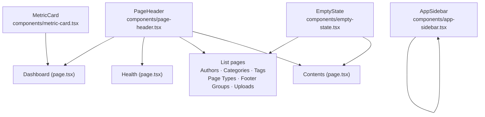

# refactor: Redesign admin dashboard visual layer with Corpus tokens

## Summary

The admin dashboard uses shadcn/ui default patterns without applying the Corpus Design System token layer formalized in June 2026. All pages share an identical unstyled header, metric cards use uniform grey icon containers regardless of semantic meaning, and the extended token set (brand navy, feature teal, status greens/reds) is completely unused in the admin app. This refactor applies Corpus tokens purposefully, extracts a shared page header component, color-codes metric and status elements, and aligns the sidebar brand mark with the design system's identity-surface convention.

---

## Problem Frame

The current dashboard has three concrete problems:

**Uniform visual structure.** Every page uses the same unstyled `<div>` block for its header — same `text-2xl font-semibold tracking-tight` h1 over a `text-sm text-muted-foreground` subtitle — with no accent, no visual weight, and no brand identity.

**No semantic color use.** MetricCard icon containers all use `bg-muted text-muted-foreground` regardless of what they represent. A sanctions source count looks identical to a system health card. The design system's status color tokens (`bg-green-0 text-green-5`, `bg-red-0 text-destructive`, `bg-teal-0 text-feature`) exist and are already used in `HealthDetailCard` — but not in MetricCard or EmptyState.

**Wrong tokens for identity surfaces.** The sidebar brand mark uses `bg-sidebar-primary` (the interactive blue). The `globals.css` comment explicitly states `--brand` (dark navy `#192e49`) is for primary identity surfaces and `--primary` (blue/7) is for interactive elements.

---

## Requirements

### Visual structure

R1. All dashboard pages use a shared `PageHeader` component that produces a consistent header with a left accent mark.
R2. The `PageHeader` component accepts an optional `action` slot so pages with a create button (Authors, Contents) and those without (Health, Dashboard) share the same component.

### Color and token usage

R3. `MetricCard` accepts a `variant` prop (`'default' | 'success' | 'error' | 'feature'`) and applies the corresponding Corpus palette classes to the icon container.
R4. The dashboard overview passes the correct variant to each MetricCard: feature (teal) for sanctions sources, success/error (green/red) for system health, default (blue) for content.
R5. `EmptyState` icon container changes from `bg-muted text-muted-foreground` to `bg-primary/10 text-primary` across all uses.
R6. The sidebar brand mark uses `bg-brand text-white` instead of `bg-sidebar-primary text-sidebar-primary-foreground`.

### Consistency

R7. All list pages (Authors, Categories, Tags, Page Types, Footer Groups, Uploads) and the Health page use `PageHeader`.
R8. Table-cell inline empty states (`<TableCell className="h-24 text-center …">No X yet</TableCell>`) are replaced with the `EmptyState` component rendered outside the table.
R9. No data fetching, routing, or business logic changes anywhere.

---

## Key Technical Decisions

**KTD1: PageHeader as a component, not a repeated pattern.**
Extracting a shared `PageHeader` component (rather than applying identical markup to each page separately) creates a single update point for future header changes and enforces structural consistency across all 9 routes. The `action` slot accepts a React node so each page passes its own create button directly.

**KTD2: `variant` prop on MetricCard, not separate card types.**
A single `variant` prop controls only the icon container colors. This keeps the existing MetricCard contract stable — the `error` boolean prop, `loading`, `href`, and all other props are unchanged. When `error` is true and no `variant` is specified, the icon defaults to `error` variant coloring.

**KTD3: Corpus palette Tailwind utilities, not inline `var()` references.**
The `@theme inline` block in `globals.css` exposes all palette colors as Tailwind utilities (`bg-green-0`, `text-green-5`, `bg-teal-0`, `text-feature`, `bg-brand`). All new styles use these utilities — no `style={{ color: 'var(--feature)' }}` or arbitrary `bg-[#00adb2]` classes.

**KTD4: Dark mode overrides required on raw palette classes.**
`bg-green-0` in dark mode is `#dafbe1` — a light green that reads poorly on the dark background `#1f2328`. Follow the pattern established in `HealthDetailCard`: pair palette backgrounds with dark-mode overrides such as `bg-green-0 dark:bg-green-4/10`. This applies to all `variant` color classes in MetricCard.

---

## High-Level Technical Design

**Component dependency graph:**



**Token mapping — before and after:**

| Element | Before | After |
|---|---|---|
| MetricCard icon — sanctions/feature | `bg-muted text-muted-foreground` | `bg-teal-0 dark:bg-teal-4/10 text-feature` |
| MetricCard icon — healthy | `bg-muted text-muted-foreground` | `bg-green-0 dark:bg-green-4/10 text-green-5` |
| MetricCard icon — error | `bg-muted text-muted-foreground` | `bg-red-0 dark:bg-red-4/10 text-destructive` |
| MetricCard icon — default/content | `bg-muted text-muted-foreground` | `bg-primary/10 text-primary` |
| Sidebar brand mark | `bg-sidebar-primary text-sidebar-primary-foreground` | `bg-brand text-white` |
| EmptyState icon | `bg-muted text-muted-foreground` | `bg-primary/10 text-primary` |

---

## Implementation Units

### U1. Extract shared `PageHeader` component

**Goal:** Create `PageHeader` to replace the repeated unstyled header block used on every dashboard page.

**Requirements:** R1, R2, R9

**Dependencies:** None

**Files:**
- `apps/admin/components/page-header.tsx` — create

**Approach:** The component accepts `title` (string), `description` (string, optional), and `action` (React node, optional). The title block uses a `border-l-2 border-primary pl-3` left accent mark — this adds visual weight without introducing color noise into the page body. The `action` renders right-aligned in a `flex items-center justify-between` outer wrapper. The health page has an inline refresh spinner next to its h1; that page should use `PageHeader` for the outer structure and render the spinner as a sibling element to the title text inside the title block using a `titleAdornment` slot, or pass the spinner inline as part of the `title` node. Resolve the exact approach at implementation time; either is acceptable as long as the accent mark and layout contract hold.

**Patterns to follow:** Existing header divs on `authors/page.tsx`, `categories/page.tsx`, and `tags/page.tsx`.

**Test scenarios:**
Test expectation: none — pure layout component with no conditional logic or data. Visual correctness verified by inspection.

**Verification:** All modified pages show the left accent mark and consistent spacing. Pages with an `action` prop render the action right-aligned. The health page refresh spinner renders adjacent to the title without layout breakage.

---

### U2. Add color-coded variants to `MetricCard`

**Goal:** Add a `variant` prop so MetricCard icon containers communicate semantic meaning through Corpus palette colors.

**Requirements:** R3, R9

**Dependencies:** None

**Files:**
- `apps/admin/components/metric-card.tsx` — modify

**Approach:** Add `variant?: 'default' | 'success' | 'error' | 'feature'` to `MetricCardProps`. Map each variant to an icon container className:
- `default` → `bg-primary/10 text-primary`
- `success` → `bg-green-0 dark:bg-green-4/10 text-green-5`
- `error` → `bg-red-0 dark:bg-red-4/10 text-destructive`
- `feature` → `bg-teal-0 dark:bg-teal-4/10 text-feature`

When `variant` is not passed, use `default`. When the existing `error` boolean prop is true and no `variant` is passed, use `error` variant coloring for the icon container. Add `shadow-sm` to the `<Card>` className.

**Patterns to follow:** `apps/admin/components/health/health-detail-card.tsx` — already uses `bg-green-0 dark:bg-green-4/10` and `bg-red-0 dark:bg-red-4/10` for status color coding.

**Test scenarios:**
Test expectation: none — presentational component with no logic beyond prop-to-class mapping. Verify each variant visually in light and dark mode.

**Verification:** Each variant renders the correct icon background and icon color. Dark mode shows muted tinted backgrounds (not bright light backgrounds on dark). The card has a subtle shadow. Existing MetricCard callers without a `variant` prop show the default (blue) coloring.

---

### U3. Redesign dashboard overview page

**Goal:** Apply `PageHeader` and color-coded MetricCard variants to the dashboard overview; improve the visual separation between the status section and quick actions.

**Requirements:** R1, R4, R9

**Dependencies:** U1, U2

**Files:**
- `apps/admin/app/(dashboard)/page.tsx` — modify

**Approach:** Replace the existing page header `<div>` block with `<PageHeader title="Dashboard" description="System status and quick navigation." />`.

Pass the appropriate variant to each MetricCard:
- `SourcesMetric` → `variant="feature"` (sanctions/AML data, teal)
- `HealthMetric` → `variant="success"` when healthy, `variant="error"` when the fetch throws or returns non-ok
- `ContentMetric` → `variant="default"` (content management, blue)

The `HealthMetric` component currently renders a MetricCard in both its success and error branches; the variant prop should be passed in both branches accordingly.

Replace the generic "Quick Actions" `<h2>` label with a short uppercase section divider: `text-xs font-medium tracking-wide uppercase text-muted-foreground`. Change the label text to "Manage" or "Workspaces" — something that communicates navigation intent, not a call to action. The `QuickAction` card component itself stays unchanged.

**Patterns to follow:** Existing `HealthMetric` component structure (success/error branches already separated); `health-detail-card.tsx` color mapping as established precedent.

**Test scenarios:**
- `HealthMetric` renders with `variant="success"` (green icon) when `data.status === 'ok'` or `data.status === 'healthy'`.
- `HealthMetric` renders with `variant="error"` (red icon) when the fetch throws.
- Suspense fallback MetricCards render with their loading state (Skeleton visible, icon in default-colored container).
- PageHeader renders the accent mark and description.

**Verification:** Dashboard shows three visually distinct metric cards. The section below the metrics is clearly labeled as navigation. No console errors on load.

---

### U4. Apply `PageHeader` and `EmptyState` to all list and section pages

**Goal:** Replace the repeated inline header block and table-cell empty states on all remaining pages.

**Requirements:** R1, R7, R8, R9

**Dependencies:** U1

**Files:**
- `apps/admin/app/(dashboard)/authors/page.tsx` — modify
- `apps/admin/app/(dashboard)/categories/page.tsx` — modify
- `apps/admin/app/(dashboard)/tags/page.tsx` — modify
- `apps/admin/app/(dashboard)/page-types/page.tsx` — modify
- `apps/admin/app/(dashboard)/footer-groups/page.tsx` — modify
- `apps/admin/app/(dashboard)/uploads/page.tsx` — modify (PageHeader only; already uses EmptyState)
- `apps/admin/app/(dashboard)/health/page.tsx` — modify (PageHeader only; no table)
- `apps/admin/app/(dashboard)/contents/page.tsx` — modify (PageHeader only; already uses EmptyState)

**Approach:** For each page, replace the `<div className="flex flex-col gap-4 sm:flex-row sm:items-center sm:justify-between">` header block with `<PageHeader title="…" description="…" action={…} />`.

For pages with a table and an inline empty-cell state (`<TableRow><TableCell colSpan={N} className="h-24 text-center text-muted-foreground">No X yet…</TableCell></TableRow>`): move the empty check outside the `<Table>`. When `!isLoading && items.length === 0`, render `<EmptyState …/>` in place of the table entirely. Keep loading skeleton rows inside the table for the loading state.

**Patterns to follow:** `apps/admin/app/(dashboard)/contents/page.tsx` for the loading/empty/data structure. `apps/admin/components/empty-state.tsx` for correct usage including the `action` prop.

**Test scenarios:**
- Authors page: when `isLoading === true`, the table with skeleton rows renders (not EmptyState).
- Authors page: when `authors.length === 0` and `isLoading === false`, `EmptyState` renders outside the table border, with a title and action button pointing to the create flow.
- Authors page: when authors exist, the table renders with no EmptyState.
- PageHeader on each modified page renders the correct title and action button.

**Verification:** All 8 modified pages show the PageHeader left accent mark. Pages with no data show `EmptyState` in the card/section area, not as a table row. Existing CRUD flows (create, edit, delete on Authors, Categories, Tags) are unaffected.

---

### U5. Sidebar brand mark token fix and `EmptyState` icon uplift

**Goal:** Apply `bg-brand` to the sidebar brand mark (identity surface) and improve EmptyState icon visibility.

**Requirements:** R5, R6, R9

**Dependencies:** None

**Files:**
- `apps/admin/components/app-sidebar.tsx` — modify
- `apps/admin/components/empty-state.tsx` — modify

**Approach:**

**Sidebar brand mark:** In `SidebarBrand`, change the icon container className from `bg-sidebar-primary text-sidebar-primary-foreground` to `bg-brand text-white`. The `--brand` token (`#192e49`, dark navy) is explicitly designated for identity surfaces in `globals.css`; `--sidebar-primary` (interactive blue) is for active navigation states.

**EmptyState icon container:** Change from:
```
bg-muted … text-muted-foreground
```
to:
```
bg-primary/10 … text-primary
```
The current `bg-muted text-muted-foreground` renders near-invisible (grey icon on grey background). The `bg-primary/10 text-primary` pattern is already established by the QuickAction icon containers in `apps/admin/app/(dashboard)/page.tsx`.

**Patterns to follow:** `QuickAction` icon containers in `apps/admin/app/(dashboard)/page.tsx`; `globals.css` inline comment distinguishing `--brand` from `--primary`.

**Test scenarios:**
Test expectation: none — one-line class changes with no conditional logic. Verify visually in both light and dark mode.

**Verification:** Sidebar brand mark shows dark navy background, visually distinct from the interactive blue active-state highlights in the nav. EmptyState icon is clearly visible with a blue-tinted background in both light and dark mode.

---

## Scope Boundaries

### In scope

- Visual layer of `apps/admin` only
- New `PageHeader` component
- `MetricCard` variant prop and color coding
- `EmptyState` icon color correction
- Sidebar brand mark token correction
- `PageHeader` applied to all 9 dashboard routes

### Deferred to Follow-Up Work

- Contents `DataTable` column layout, density, or sorting improvements
- Count/total indicator on MetricCard (e.g., "3 of 12 active")
- Dashboard recent-items widget or activity feed
- Login page (`/app/(auth)/login/page.tsx`) redesign
- Typography scale mapped as additional Tailwind utilities in `@theme inline`

### Out of scope

- Data fetching, API routes, or business logic
- Navigation restructuring or new routes
- Contents new/edit form redesign
- Any changes to `apps/web` or `packages/ui`

---

## Risks and Dependencies

**Dark mode palette classes require explicit overrides.**
Raw palette background classes like `bg-green-0` and `bg-teal-0` are light values that do not invert in dark mode. The implementer must add `dark:bg-green-4/10`, `dark:bg-teal-4/10`, and `dark:bg-red-4/10` overrides for each variant (see KTD4). The established pattern is in `apps/admin/components/health/health-detail-card.tsx`.

**Health page header — refresh spinner placement.**
The health page renders a `RefreshCw` spinner inline next to the h1. Integrating `PageHeader` there requires either a `titleAdornment` slot on PageHeader or keeping the spinner as a sibling element. This is a small in-unit decision; either approach is acceptable as long as the accent mark renders.

**Corpus token layer is already wired.**
`packages/ui/styles/globals.css` exposes all required utilities (`bg-brand`, `bg-teal-0`, `text-feature`, `bg-green-0`, `text-green-5`, `bg-red-0`) via `@theme inline`. `apps/admin/app/globals.css` imports `@specus/ui/styles/globals.css`. No `globals.css` changes are needed for this plan.

---

## System-Wide Impact

All changes are confined to `apps/admin`. The `packages/ui` shared component library and `apps/web` are not modified. The Corpus token layer in `packages/ui/styles/globals.css` is not modified — it is already in the correct state from the June 2026 design system formalization commit.
